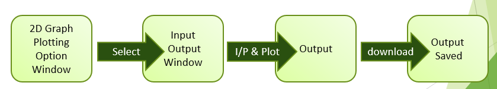
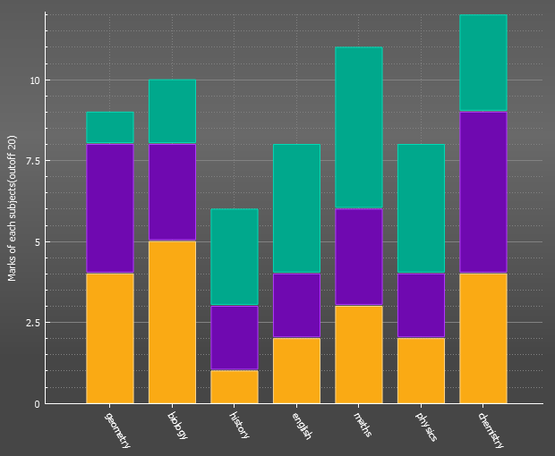
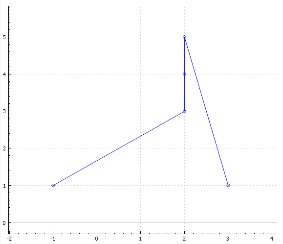

### Graph-Plotting-Application

- This is an application useful for data visualization in 2D. 
- It can be used to summarize large dataset in visual form. 
- With this application you can plot standard curves (also known as calibration curves) and statistical charts.

### Pre-requisites
1. Qt Creator (version 5.0.0 or above)
2. QcustomPlot

### Overview 

### Features

statistical charts

| Bar chart                                     | Line chart                      |
| --------------------------------------------- | ------------------------------- |
|   |  |

